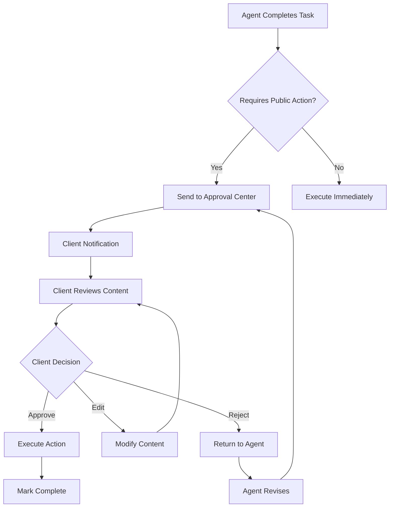

# The Zenith Enhanced Agentic Workforce Blueprint
## Autonomous, Outcome-Driven Digital Agency with Human-in-the-Loop Safety

**Version**: 2.0  
**Date**: June 21, 2025  
**Objective**: Evolve Zenith into an autonomous, outcome-driven system that can analyze, manage, create, and build a client's entire digital presence through a large-scale workforce of specialized AI agents, all managed with secure, human-in-the-loop oversight.

---

## Executive Summary

This enhanced blueprint introduces the **Approval Center** - the game-changing safety layer that makes the agentic system trustworthy, practical, and production-ready. Clients maintain full control while benefiting from autonomous agent capabilities, creating the perfect balance between automation and oversight.

---

## Section 1: The Core Architecture - The Agent Orchestrator & Backend

### Dedicated Backend Service
**Technology Stack**:
- **Framework**: Python/FastAPI (recommended for AI ecosystem compatibility)
- **Queue System**: BullMQ with Redis for task management
- **Real-time Updates**: WebSockets for live mission tracking
- **Database**: PostgreSQL with Prisma ORM

### Primary Endpoint
**POST /api/agents/delegate**
- Takes high-level client goals and initiates "Missions"
- Decomposes goals into agent-specific tasks
- Routes tasks through Approval Center workflow
- Returns mission tracking ID for real-time monitoring

---

## Section 2: The Approval Center & Human-in-the-Loop (HITL) Workflow

### The Critical Safety Layer

**Purpose**: Ensure all agent actions requiring public execution are reviewed and approved by clients before deployment.

### UI Implementation
**Location**: Dedicated "Approval Center" tab in main Zenith dashboard

**Features**:
- **Pending Approvals Queue**: All agent outputs requiring review
- **Live Preview**: See exactly how content will appear when published
- **Inline Editing**: Modify agent-generated content directly
- **Batch Operations**: Approve/reject multiple items at once
- **Approval History**: Complete audit trail of all decisions

### Workflow Process



### Tiered Autonomy (Enterprise Feature)

**Auto-Approval Rules**: Enterprise clients can configure automatic approval for specific scenarios:

**Examples**:
- "Auto-approve replies to all 5-star reviews"
- "Auto-publish blog posts with Content Grade A+"
- "Auto-schedule social posts for optimal engagement times"
- "Auto-respond to common support queries"

**Configuration Interface**:
```typescript
interface AutoApprovalRule {
  id: string;
  name: string;
  agentType: string;
  conditions: {
    contentGrade?: 'A+' | 'A' | 'B+';
    reviewRating?: number;
    contentType?: string;
    timeRestrictions?: string[];
  };
  actions: {
    autoApprove: boolean;
    requireSecondary: boolean;
    maxPerDay?: number;
  };
}
```

---

## Section 3: The Scaled-Up Agentic Workforce

### Division A: Client-Facing Agents (The "Digital Agency")

#### Core Strategy Agents

**AnalystAgent**: The Data Intelligence Engine
- **Purpose**: Continuously monitors digital landscape and client performance
- **Capabilities**:
  - Competitor analysis and benchmarking
  - Market trend identification
  - Performance anomaly detection
  - Opportunity identification
- **Output**: Daily intelligence briefs and strategic recommendations

**StrategistAgent**: The Master Planner
- **Purpose**: Converts analyst data into actionable strategies
- **Capabilities**:
  - Campaign strategy development
  - Resource allocation optimization
  - ROI forecasting and planning
  - Integration with Vision Sandbox for scenario planning
- **Output**: Strategic plans and execution roadmaps

#### Content Creation Agents

**ContentAgent**: The Writing Engine
- **Purpose**: SEO-optimized content creation across all formats
- **Capabilities**:
  - Blog posts and articles
  - Website copy and landing pages
  - Email campaigns and newsletters
  - Technical documentation
- **Quality Controls**: Built-in plagiarism detection, SEO optimization, readability scoring

**MediaAgent**: The Creative Powerhouse
- **Purpose**: Visual content creation and optimization
- **Tools**: DALL-E 3, Midjourney, Pictory integration
- **Capabilities**:
  - Custom logos and branding assets
  - Social media graphics and banners
  - Explainer videos from text prompts
  - Web-optimized image compression (CompressionAgent)
- **Quality Controls**: Brand guideline compliance, format optimization

#### Engagement & Community Agents

**SocialMediaAgent**: The Social Media Manager
- **Purpose**: Complete social media lifecycle management
- **Capabilities**:
  - Content calendar planning and optimization
  - Multi-platform posting and scheduling
  - Engagement analysis and optimization
  - Trending topic integration
- **Approval Flow**: All posts go through Approval Center before publishing

**CommunityManagerAgent**: The Reputation Guardian
- **Purpose**: Brand reputation management across all platforms
- **Capabilities**:
  - Review response drafting (Google, Yelp, industry platforms)
  - Social media comment management
  - Crisis communication preparation
  - Sentiment monitoring and alerting
- **Approval Flow**: All public responses require client approval

#### Technical & Implementation Agents

**UI/UXEngineerAgent**: The No-Code Builder
- **Purpose**: Conversational website and component generation
- **Capabilities**:
  - React component generation from natural language
  - Full page creation with Zenith design system
  - Iterative design through Vision Sandbox
  - Responsive and accessible code generation
- **Integration**: Direct GitHub PR creation for developer review

**AdCampaignAgent**: The Performance Marketer
- **Purpose**: Paid advertising campaign management
- **Capabilities**:
  - Ad copy generation and A/B testing
  - Targeting strategy development
  - Budget allocation optimization
  - Performance monitoring and adjustment
- **Approval Flow**: Campaign drafts require approval before launch

**CRMAgent**: The Customer Data Orchestrator
- **Purpose**: Complete CRM automation and optimization
- **Capabilities**:
  - HubSpot, Salesforce, Pipedrive integration
  - Lead scoring and segmentation
  - Automated email sequences
  - Sales pipeline optimization
- **Security**: Uses Master Login credentials for secure access

### Division B: Internal Zenith Agents (The "Autonomous COO")

#### Platform Optimization Agents

**CostOptimizerAgent**: The Financial Efficiency Engine
- **Purpose**: Continuous cost reduction and resource optimization
- **Capabilities**:
  - Cloud resource monitoring and optimization
  - API usage analysis and cost reduction
  - Performance vs. cost trade-off analysis
  - Automated scaling recommendations
- **Impact**: Target 30% operational cost reduction

**PerformanceAgent**: The Platform Guardian
- **Purpose**: Zenith platform performance monitoring and optimization
- **Capabilities**:
  - Core Web Vitals monitoring
  - Backend response time analysis
  - Database query optimization
  - CDN and caching improvements
- **Integration**: Real-time alerts and automated optimization

#### Quality & Development Agents

**QAAgent**: The Automated Quality Engineer
- **Purpose**: Comprehensive testing and quality assurance
- **Capabilities**:
  - Automated test suite execution
  - Preview deployment testing
  - Performance regression detection
  - Security vulnerability scanning
- **Integration**: Comments on GitHub PRs with test results

**SelfHealingAgent**: The Autonomous Platform Doctor
- **Purpose**: End-to-end platform issue resolution
- **Orchestration**: Coordinates PerformanceAgent, DeveloperAgent, and QAAgent
- **Capabilities**:
  - Issue detection and diagnosis
  - Automated bug fixing and PR creation
  - Performance optimization implementation
  - Self-monitoring and improvement
- **First Mission**: Fix the 500 error on landing page autonomously

#### Strategic & Innovation Agents

**InnovationAgent**: The Strategic R&D Engine
- **Purpose**: Continuous technological advancement monitoring
- **Monitoring Sources**:
  - Tech news aggregation (TechCrunch, VentureBeat, Ars Technica)
  - GitHub trending repositories analysis
  - AI conference keynote processing
  - Competitor feature launch tracking
  - Research paper analysis (arXiv, Google Research)
- **Output**: Weekly "Innovation Brief" with implementation roadmap

**OnboardingAgent**: The Client Success Accelerator
- **Purpose**: "Foundation Fast-Track" automation for new clients
- **Capabilities**:
  - Automated account setup and configuration
  - Personalized onboarding journey creation
  - Progress tracking and optimization
  - Success milestone celebration
- **Integration**: Direct integration with Approval Center setup

**MonthlyReleaseAgent**: The Deployment Automation Engine
- **Purpose**: Automated monthly version release cycle
- **Capabilities**:
  - Feature completion analysis and compilation
  - Release note generation with marketing copy
  - Version number management across all services
  - Deployment configuration and scheduling
  - Marketing material creation for new features

---

## Section 4: Database Schema Extensions

### Approval Center Models

```prisma
model ApprovalRequest {
  id              String            @id @default(cuid())
  missionId       String
  mission         Mission           @relation(fields: [missionId], references: [id])
  agentType       String
  taskType        String
  contentType     String            // 'social_post', 'blog_article', 'review_reply'
  originalContent Json
  editedContent   Json?
  status          ApprovalStatus    @default(PENDING)
  priority        Priority          @default(NORMAL)
  clientId        String
  client          User              @relation(fields: [clientId], references: [id])
  reviewedAt      DateTime?
  approvedAt      DateTime?
  rejectedAt      DateTime?
  rejectionReason String?
  autoApprovalRule String?          // Reference to rule that auto-approved
  createdAt       DateTime          @default(now())
  updatedAt       DateTime          @updatedAt
  
  @@map("approval_requests")
}

model AutoApprovalRule {
  id              String            @id @default(cuid())
  name            String
  clientId        String
  client          User              @relation(fields: [clientId], references: [id])
  agentType       String
  conditions      Json              // Conditions for auto-approval
  actions         Json              // Actions to take when conditions met
  isActive        Boolean           @default(true)
  createdAt       DateTime          @default(now())
  updatedAt       DateTime          @updatedAt
  
  @@map("auto_approval_rules")
}

enum ApprovalStatus {
  PENDING
  APPROVED
  REJECTED
  EDITING
  AUTO_APPROVED
}
```

---

## Section 5: API Endpoints

### Approval Center APIs

```typescript
// Get pending approvals for client
GET /api/approvals/pending

// Approve content
POST /api/approvals/{id}/approve

// Reject content with reason
POST /api/approvals/{id}/reject
{
  "reason": "Content needs to be more professional",
  "returnToAgent": true
}

// Edit and approve content
POST /api/approvals/{id}/edit-approve
{
  "editedContent": {...},
  "comment": "Updated tone and added CTA"
}

// Configure auto-approval rules
POST /api/approvals/rules
{
  "name": "Auto-approve 5-star review replies",
  "agentType": "CommunityManagerAgent",
  "conditions": {
    "reviewRating": 5,
    "contentType": "review_reply"
  },
  "actions": {
    "autoApprove": true,
    "maxPerDay": 10
  }
}
```

---

## Section 6: Implementation Roadmap

### Phase 1: Approval Center Foundation (Month 1)
- ✅ Agent Orchestrator infrastructure (Complete)
- ✅ Database schema and API endpoints (Complete)
- 🔄 Approval Center UI implementation
- 🔄 Human-in-the-loop workflow integration

### Phase 2: Core Agent Implementation (Month 2)
- ContentAgent with approval workflow
- SocialMediaAgent with scheduling integration
- CommunityManagerAgent for review management
- Basic auto-approval rule engine

### Phase 3: Advanced Agents & Automation (Month 3)
- MediaAgent with creative generation
- UI/UXEngineerAgent with Vision Sandbox
- SelfHealingAgent first mission implementation
- Advanced auto-approval configurations

### Phase 4: Full Ecosystem Deployment (Month 4)
- Complete Division A and B agent deployment
- InnovationAgent intelligence gathering
- MonthlyReleaseAgent automation
- Enterprise tiered autonomy features

---

## Section 7: Business Impact & Competitive Moats

### Trust & Safety Moats
- **Human-in-the-Loop**: First platform with built-in approval workflow
- **Tiered Autonomy**: Configurable automation levels for different client needs
- **Audit Trail**: Complete transparency and accountability
- **Quality Assurance**: Multi-layer quality controls and peer review

### Operational Efficiency Moats
- **Self-Healing Platform**: Autonomous issue detection and resolution
- **Innovation Intelligence**: Automated competitive advantage maintenance
- **Cost Optimization**: Continuous operational expense reduction
- **Quality Consistency**: Standardized best practices across all agents

### Revenue Model Evolution
- **Outcome-Based Pricing**: Charge for delivered results, not tool access
- **Enterprise Autonomy**: Premium pricing for advanced auto-approval features
- **Managed Service**: Full-service digital agency without agency overhead
- **White-Label Licensing**: Platform-as-a-Service for other businesses

---

## Conclusion: The Trustworthy Autonomous Partner

This enhanced blueprint creates a SaaS product that is not just a tool, but a **true, autonomous partner** for clients and a **hyper-efficient, self-improving business**. The Approval Center makes it production-ready, trustworthy, and scalable while maintaining the transformative power of autonomous agent operations.

**The result**: A platform that clients trust enough to delegate their entire digital presence to, while maintaining full control and oversight through the human-in-the-loop workflow.

**Zenith becomes the world's first trustworthy autonomous digital agency - combining the efficiency of AI with the oversight humans demand.**

---

**Next Steps**: Implement Approval Center UI and workflow integration for the first production-ready autonomous agent operations.
