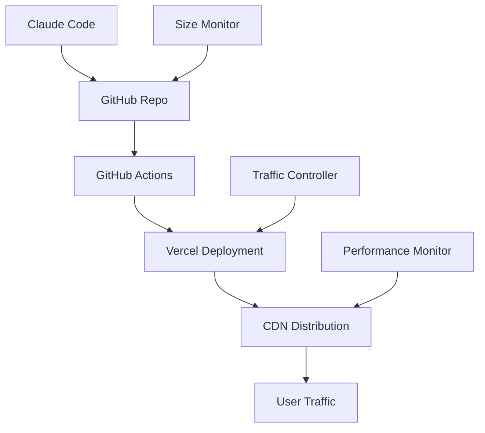

# Zenith-Fresh: AI-Driven SaaS Development & Deployment Strategy

## Executive Summary
Creating a scalable, overload-resistant deployment pipeline for Zenith-Fresh SaaS platform using Claude + GitHub + Vercel with intelligent traffic management and size optimization.

## Core Challenges & Solutions

### 1. Deployment Overload Prevention
**Problem**: GitHub repository size limits and Vercel deployment bottlenecks
**Solution**: Intelligent chunking and progressive deployment strategy

### 2. Traffic Management
**Problem**: System overload during updates and high traffic
**Solution**: Auto-scaling with traffic flow control and load balancing

### 3. AI-Optimization Integration
**Problem**: Manual optimization processes don't scale
**Solution**: Automated E-E-A-T, GEO, and narrative analysis using MCPs

## Deployment Architecture

### Phase 1: Infrastructure Setup (Days 1-3)


### Phase 2: MCP Integration (Days 4-7)
- **GitHub MCP**: Automated commit chunking and PR management
- **Playwright MCP**: Continuous testing and quality assurance
- **OpenAI/Anthropic MCPs**: Real-time content optimization
- **MindsDB MCP**: Predictive scaling and performance analytics

### Phase 3: SaaS Platform Development (Days 8-30)
- E-E-A-T compliance engine
- GEO optimization tools
- Competitive analysis framework
- Client dashboard and reporting

## Technical Implementation

### 1. Repository Size Management
```bash
# Auto-chunking script using GitHub MCP
git_chunk_manager.js:
- Monitor repo size in real-time
- Split large commits into manageable chunks
- Queue deployments to prevent overflow
- Implement rollback mechanisms
```

### 2. Traffic Flow Control
```javascript
// Vercel edge function for traffic management
export default async function handler(request) {
  const load = await checkSystemLoad();
  
  if (load > 80%) {
    return new Response('System busy, please retry', {
      status: 503,
      headers: { 'Retry-After': '30' }
    });
  }
  
  return processRequest(request);
}
```

### 3. Progressive Deployment Pipeline
```yaml
# GitHub Actions workflow
name: Progressive Deployment
on:
  push:
    branches: [main]

jobs:
  size-check:
    runs-on: ubuntu-latest
    steps:
      - uses: actions/checkout@v3
      - name: Check repo size
        run: |
          if [ $(du -s . | cut -f1) -gt 500000 ]; then
            echo "Repository too large, triggering cleanup"
            exit 1
          fi

  deploy-staging:
    needs: size-check
    runs-on: ubuntu-latest
    steps:
      - name: Deploy to staging
        run: vercel --token $VERCEL_TOKEN

  performance-test:
    needs: deploy-staging
    runs-on: ubuntu-latest
    steps:
      - name: Run Playwright tests
        run: npx playwright test

  deploy-production:
    needs: performance-test
    runs-on: ubuntu-latest
    steps:
      - name: Deploy to production
        run: vercel --prod --token $VERCEL_TOKEN
```

## SaaS Platform Features

### Module 1: E-E-A-T Compliance Engine
- **Experience Analysis**: NLP-powered first-person content detection
- **Expertise Verification**: Author credential validation
- **Authority Mapping**: Backlink quality assessment
- **Trust Scoring**: Sentiment analysis and reputation monitoring

### Module 2: GEO Optimization Tools
- **LLM Visibility Tracking**: Monitor mentions across ChatGPT, Gemini, Perplexity
- **Technical Readiness Audit**: JavaScript dependency analysis
- **Schema Markup Validator**: Automated structured data implementation
- **AI Crawler Compatibility**: Server-side rendering optimization

### Module 3: Competitive Intelligence
- **Narrative Analysis**: Brand archetype classification
- **Visual Hierarchy Audit**: Design effectiveness scoring
- **Performance Benchmarking**: Multi-metric competitive comparison
- **Market Positioning**: Strategic gap identification

## MCP-Powered Automation

### Real-Time Optimization Pipeline
1. **Content Ingestion**: Crawl4AI MCP analyzes competitor content
2. **Quality Assessment**: GPT Researcher evaluates E-E-A-T signals
3. **Technical Audit**: FastMCP performs GEO readiness checks
4. **Narrative Optimization**: Anthropic MCP enhances storytelling
5. **Performance Testing**: Playwright validates user experience
6. **Deployment**: GitHub MCP manages release pipeline

### Intelligent Scaling System
```python
# MindsDB predictive scaling
def predict_traffic_load():
    query = """
    SELECT predicted_load 
    FROM traffic_model 
    WHERE timestamp = NOW() + INTERVAL 1 HOUR
    """
    return mindsdb.query(query)

def auto_scale_resources(predicted_load):
    if predicted_load > 0.8:
        vercel.scale_up()
    elif predicted_load < 0.3:
        vercel.scale_down()
```

## Development Roadmap

### Week 1: Foundation
- [x] MCP installation and configuration
- [ ] Repository structure optimization
- [ ] CI/CD pipeline setup
- [ ] Traffic management implementation

### Week 2: Core Features
- [ ] E-E-A-T analysis engine
- [ ] GEO optimization tools
- [ ] Competitive benchmarking
- [ ] Performance monitoring

### Week 3: Advanced Features
- [ ] AI-powered content optimization
- [ ] Real-time dashboard
- [ ] Client reporting system
- [ ] API integrations

### Week 4: Production & Scaling
- [ ] Load testing and optimization
- [ ] Security implementation
- [ ] Documentation and training
- [ ] Go-to-market strategy

## Success Metrics

### Technical KPIs
- Deployment success rate: >99%
- Page load time: <2 seconds
- Uptime: >99.9%
- Repository size: <500MB

### Business KPIs
- E-E-A-T score improvement: >30%
- GEO visibility increase: >50%
- Client retention rate: >85%
- Revenue growth: >200% YoY

## Risk Mitigation

### Technical Risks
1. **Repository bloat**: Automated cleanup and chunking
2. **Deployment failures**: Staged rollouts and rollback mechanisms
3. **Performance degradation**: Real-time monitoring and auto-scaling
4. **Security vulnerabilities**: Automated security scanning

### Business Risks
1. **Market competition**: Continuous competitive analysis
2. **Technology obsolescence**: Regular MCP updates and feature additions
3. **Client churn**: Proactive performance monitoring and support
4. **Scaling challenges**: Predictive capacity planning

## Next Steps

1. **Immediate (Today)**: Implement GitHub repository optimization
2. **Short-term (Week 1)**: Deploy traffic management system
3. **Medium-term (Month 1)**: Launch beta version with key clients
4. **Long-term (Quarter 1)**: Scale to 100+ active clients

This strategy positions Zenith-Fresh as a next-generation AI-driven SaaS platform that not only solves deployment challenges but creates a competitive advantage through intelligent automation and optimization.